# ARST: Autonomous Dual-Mode Robotic System
###### Recreation of the robot TARS from the movie Interstellar, but IDK anything about copyright so I'm calling it ARST

This is a recreation of TARS, the robot from the movie Interstellar. This repository is the source code for the robot. The robot can move around, talk, and respond to voice commands.

### What is it?
TARS is an advanced robotic system designed to operate in two distinct modes—Idle and Active—to intelligently interact with its environment and respond to human commands.

#### Idle Mode
In this mode, TARS continuously scans its surroundings using state-of-the-art object detection and sensor fusion. It logs detected objects, tracks the duration since each was last seen, and autonomously navigates using pathfinding and obstacle avoidance to reacquire lost objects. The system also listens for its activation trigger (its name) to transition into active mode.

#### Active Mode
Once activated, TARS switches to Active mode where it processes and executes human commands. Leveraging a powerful LLM instruct model, the system interprets commands, calls the appropriate functions (such as providing system status, retrieving information, or executing movement commands), and interacts with users in a natural, conversational manner.
